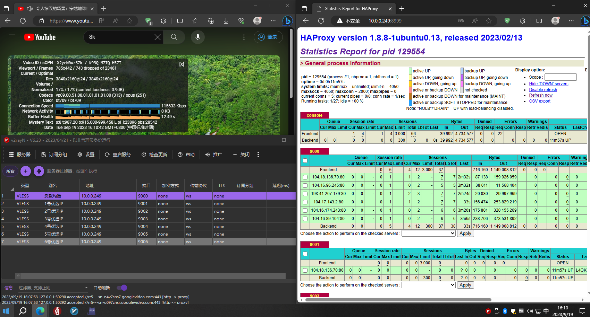

# cmliu/AutoCloudflareSpeedTest2HAProxy
自动CloudflareSpeedTest后将优选IP配置部署HAProxy负载均衡

测试运行环境ubuntu-18.04-standard_18.04.1-1_amd64

## 一键脚本
 
``` bash
wget -N -P ACFST2HAProxy https://raw.githubusercontent.com/cmliu/BreadcrumbsAutoCloudflareSpeedTest2HAProxy/main/ACFST2HAProxy.sh && cd ACFST2HAProxy && chmod +x ACFST2HAProxy.sh && bash ACFST2HAProxy.sh
```

自定义测速命令
``` bash
bash ACFST2HAProxy.sh [自定义测速端口] [测速数量] [下载速度下限] [测速延迟]
```

| 参数名| 中文解释| 一键脚本参数必填项 | 备注(注意!参数必须按顺序填写)  |
|--------------------------|----------------|-----------------|-----------------|
| port | 自定义测速端口  | × | 80、8080、8880、2052、2082、2086、2095、443、2053、2083、2087、2096、8443，默认 80 **(实测下来80端口速度最快)**|
| STcount |测速数量 | × | 默认 6 |
| speedlower |下载速度下限 | × | 默认 8mb/s |
| STmax |测速延迟 | × | 默认 230ms |

```
例如:
bash ACFST2HAProxy.sh 2052 8 8 200

CloudflareSpeedTest 测速任务完成
测速端口2052, 需求8个优选IP, 下载速度至少8mb/s, 延迟不超过200ms
HAProxy负载均衡 启动成功
负载均衡详细信息面板 http://内网IP:8999
负载均衡IP端口: 内网IP:9000
1号优选IP端口: 内网IP:9001
2号优选IP端口: 内网IP:9002
3号优选IP端口: 内网IP:9003
4号优选IP端口: 内网IP:9004
5号优选IP端口: 内网IP:9005
6号优选IP端口: 内网IP:9006
7号优选IP端口: 内网IP:9007
8号优选IP端口: 内网IP:9008
```

有条件的可以自行准备脚本目录下的ip.txt文件，可实现第三方IP测速。


## 定时任务
``` bash
cd /root/ACFST2HAProxy && chmod +x ACFST2HAProxy.sh && bash ACFST2HAProxy.sh
```

## 实测效果


## 文件结构
```
ACFST2HAProxy
 ├─ ACFST2HAProxy.sh    #脚本本体
 ├─ CloudflareST        #CloudflareST测速程序
 ├─ haproxy.cfg.bk      #HAProxy负载均衡配置模版
 ├─ haproxy.cfg         #HAProxy负载均衡配置
 ├─ ip.txt              #测速IP库
 └─ log                 #测速结果
     ├─ 80.csv          #对应端口的测速结果
    ...
     └─ 2052.csv

```
</details>

# 感谢
 [XIU2](https://github.com/XIU2/CloudflareSpeedTest)等
